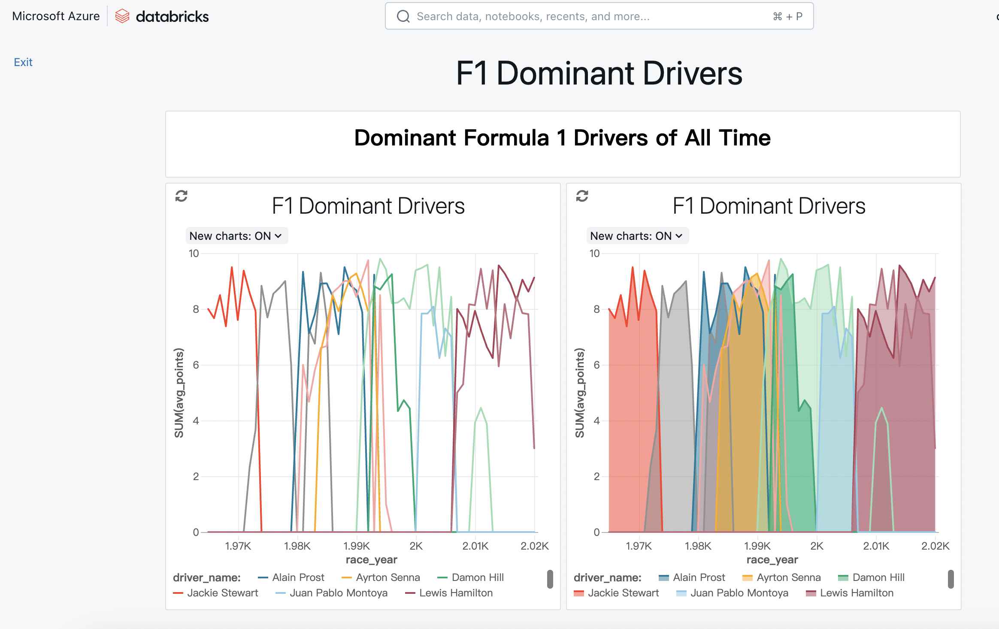
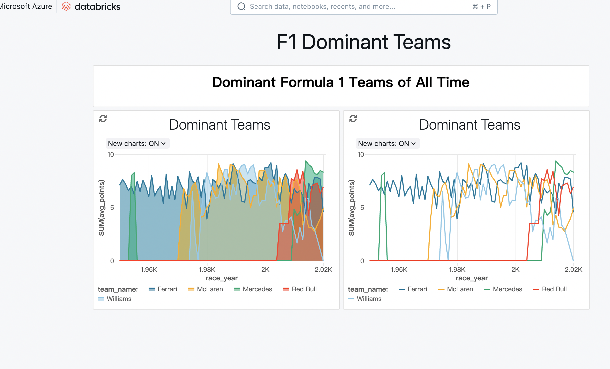
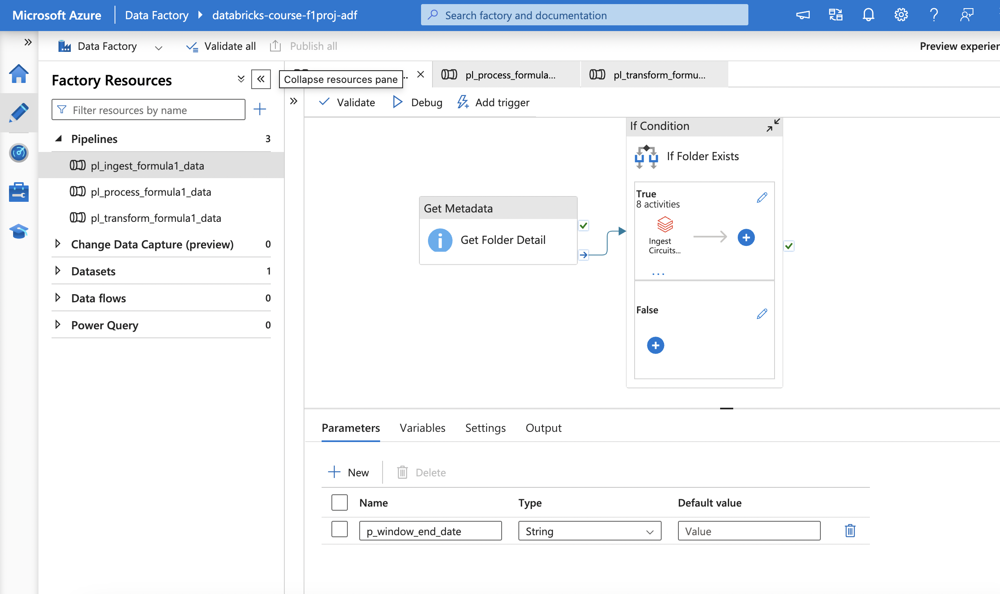
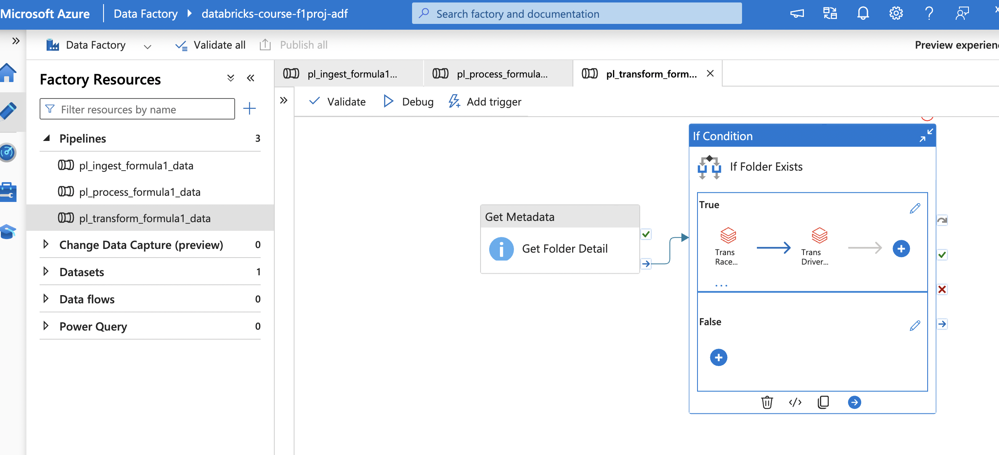
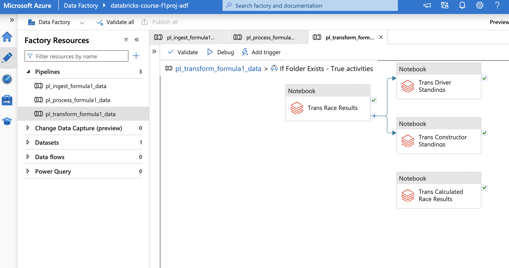
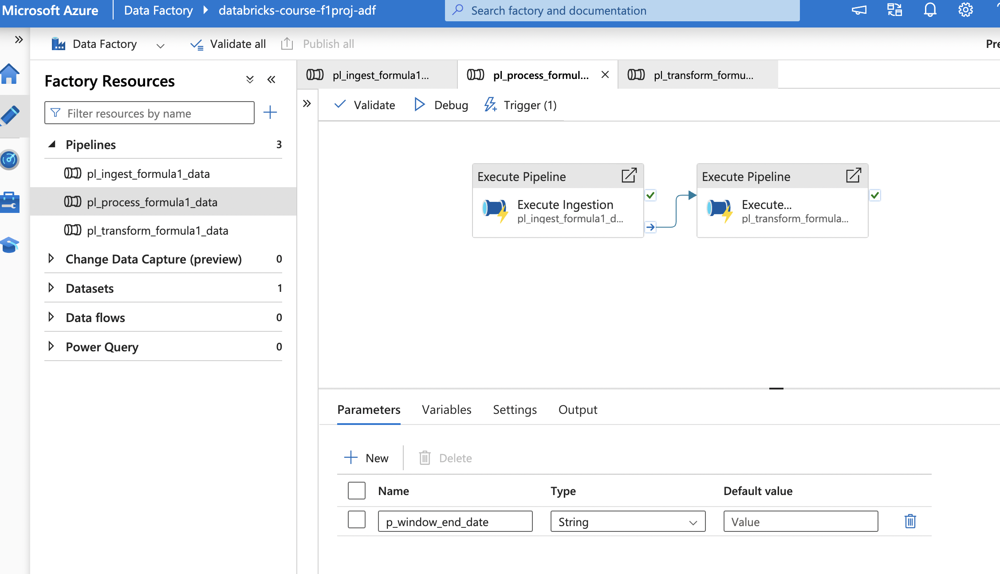
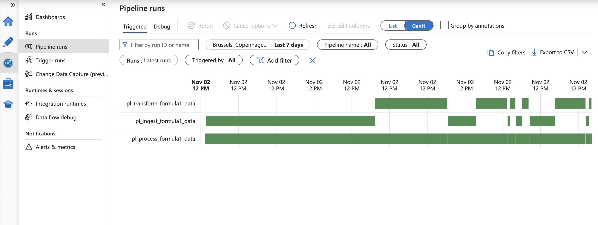
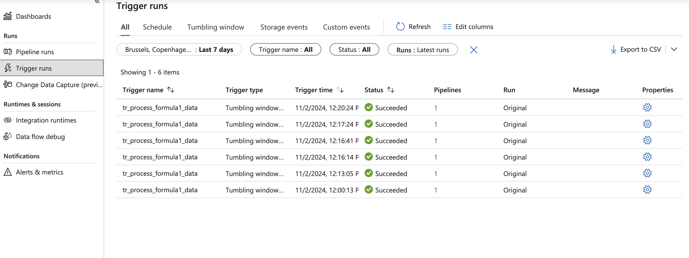

## Azure Databricks ETL Project for Formula 1 Data Analysis

### Project Overview
This project involves the development of an ETL (Extract, Transform, Load) pipeline for processing and analyzing Formula 1 data using Azure Databricks and Spark. The pipeline is designed with a three-layer architecture (bronze, silver, and gold) to efficiently manage data ingestion, transformation, and analysis. The main goal is to provide valuable insights into the performance of drivers and constructors.

### Key Features
1. Data Ingestion & Transformation
- Data Source: Formula 1 data was ingested from the Ergast API.
- Technologies Used: Python, PySpark, SQL.
- Data Storage: Data was stored in Azure Data Lake in Delta format to support efficient querying and incremental data loading.
- Incremental Load: Implemented logic to handle incremental data updates, ensuring that the pipeline is optimized for continuous data integration.

2. Data Analysis & Visualization
- Analysis: Conducted comprehensive analysis of drivers’ and constructors’ standings to identify top performers and trends.
- Visualization: Created interactive dashboards showcasing dominant drivers and teams, providing an accessible view of key insights and trends.

3. Pipeline Automation & Monitoring
- Scheduling: Developed ETL workflows in Azure Data Factory to automate and schedule data pipelines.
- Monitoring: Integrated monitoring capabilities within Azure Data Factory to oversee pipeline performance and ensure smooth, end-to-end data processing.


### Technologies Used
- Azure Databricks
- Spark and PySpark
- Python
- SQL
- Azure Data Lake (Delta format)
- Azure Data Factory

### Project Highlights
- Scalable Architecture: Utilized a three-layer data architecture (bronze, silver, and gold) to streamline data management.
- Incremental Data Loading: Enhanced pipeline efficiency by implementing logic for handling new and updated data.
- Dashboards: Provided visual insights into Formula 1 standings and trends to support data-driven decision-making.
Outcome
- This ETL project has significantly improved the accessibility of Formula 1 data for reporting and analysis. The resulting dashboards and analyses provide valuable insights into driver and constructor performance, facilitating data-driven exploration and reporting.

### How to Use
- Clone the Repository:
  ```bash
  git clone https://github.com/xulitong22/formula1_ETL_project.git
  ```

- Set Up Azure Databricks and Data Lake: Ensure your Azure Databricks environment and Data Lake storage are properly configured.

- Run Notebooks: Execute the provided notebooks to ingest, transform, and analyze the data.



- Monitor Pipelines: Use Azure Data Factory to schedule and monitor ETL workflows.







